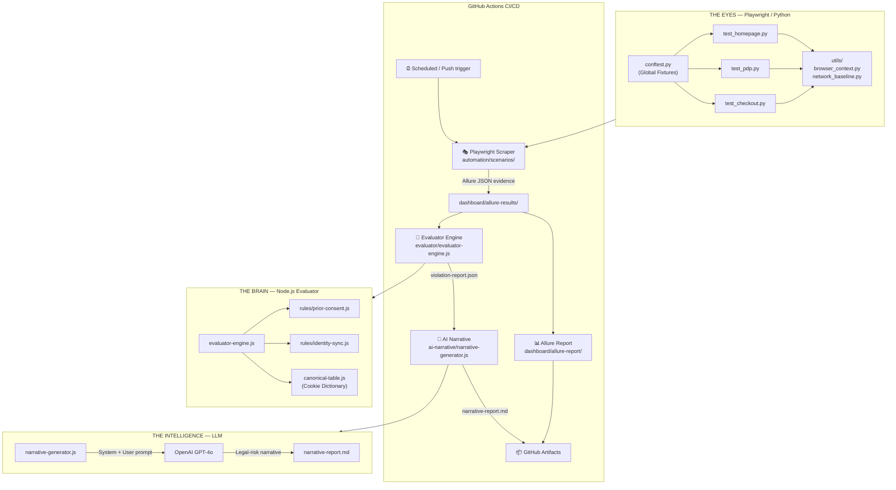

# Architecture — Compliance Sentinel Platform

End-to-end data flow from automated browser audit through to AI-generated
legal-risk narrative and Allure HTML dashboard.

## System Overview



## Component Details

### THE EYES — `automation/`

| File | Purpose |
|------|---------|
| `conftest.py` | Global pytest fixtures: browser launch, pristine context, network capture |
| `utils/browser_context.py` | Factory functions for clean BrowserContext instances |
| `utils/network_baseline.py` | Domain-level tracking detection and request classification |
| `scenarios/test_homepage.py` | Audit: homepage pre-consent baseline |
| `scenarios/test_pdp.py` | Audit: product detail page advertising pixel audit |
| `scenarios/test_checkout.py` | Audit: checkout Google Identity Sync & payment beacon audit |

**Key design choice:** Every test runs in a brand-new browser context with zero
cookies, simulating a first-time visitor. This is the only way to reliably detect
prior-consent violations — if you reuse a context, consent cookies from a previous
test may mask the violation.

### THE BRAIN — `evaluator/`

| File | Purpose |
|------|---------|
| `canonical-table.js` | Master dictionary of known cookies with vendor, category, and consent requirement |
| `rules/prior-consent.js` | Classifies tracking requests by domain; generates `PRIOR_CONSENT` and `COOKIE_WITHOUT_CONSENT` violations |
| `rules/identity-sync.js` | Detects Google Identity Sync patterns (NID, DSID, gen_204); generates `IDENTITY_SYNC` violations |
| `evaluator-engine.js` | Orchestrates: reads Allure JSON → runs rules → deduplicates → writes `violation-report.json` |

**Severity escalator:**

```
identity_sync  →  CRITICAL
advertising    →  HIGH
analytics      →  MEDIUM
functional     →  LOW
```

### THE INTELLIGENCE — `ai-narrative/`

| File | Purpose |
|------|---------|
| `narrative-generator.js` | Reads `violation-report.json`, builds structured prompts, calls OpenAI, writes `narrative-report.md` |
| `prompts.example` | Sanitised prompt engineering examples with annotated model output |

**Prompt strategy:**
- System prompt anchors the model as a GDPR expert (suppresses disclaimers, improves legal citation accuracy)
- Temperature 0.3 for factual consistency
- Violation list capped at 30 items to stay within context window; summary statistics cover the rest

### THE INTERFACE — `dashboard/`

Allure is used as the reporting layer:
- `allure-results/` — raw JSON evidence from pytest runs (git-ignored; generated per run)
- `allure-report/` — static HTML dashboard (sample included for showcase purposes)

## CI/CD Pipeline (`.github/workflows/compliance-audit.yml`)

```
scrape-and-audit (matrix: homepage / pdp / checkout)
        │
        ▼ (artifacts: allure-results-*)
evaluate-violations
        │
        ▼ (artifact: violation-report.json)
generate-narrative
        │
        ▼ (artifact: narrative-report.md)
publish-report  ◄── (also runs in parallel from scrape-and-audit)
        │
        ▼ (artifact: allure-html-report)
```

Scheduled to run daily at 06:00 UTC and on every push to `main`.
CI exits with code 1 if CRITICAL violations are detected, enabling branch protection gates.
